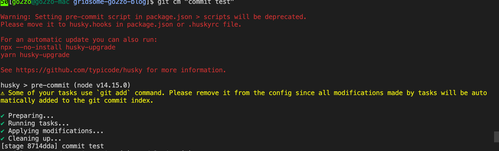

# 반복적인, 번거로운 lint

필자는 지식이 얕아 lint를 코딩 룰 체크용도만 주로 사용한다. 항상 코딩 단계에서 콤마나 세미콜론을 챙길 수 없기에 주기적, 혹은 커밋 직전에 `eslint --fix`를 이용해 일괄 수정한다.

하지만 lint를 매번 일일이 실행하기도 번거롭고 특히 깜빡하고 실행하지 않고 커밋하는 경우도 종종 발생하게 된다. 협업을 할 때도 원격 저장소를 pull하면 단순히 다른 개발자와 indent 설정이 tab이냐 space냐에 따라 충돌이 일어나기도 한다.(이것은 lint 말고도 [`.editorconfig`](https://editorconfig.org/)로도 처리가 가능하긴 하다.) 비단 팀 프로젝트 뿐 아니라 1인 프로젝트라고 이런 일이 발생하지 않는 것은 아니다. 어느 지나가는 블로그 글에서 봤는데 **1인 프로젝트에서의 맴버는 미래의 나**라는 말이 참으로 와 닿았다. 커밋 전에 linting을 하지 않으면 미래의 내가 지금 나한테 욕을 할지도 모른다.

`git hook`은 존재만 알고 있고 `lint-staged`는 뭔지 알지도 못하던 와중에 현재 블로그를 만들며 참조한 스타터에 해당 패키지가 설정되어 있었다. 하지만 왠지 설정에 뭔가 누락된 듯하고 실제로 동작도 하지 않고 있었다. 왜일까? `package.json`에 설정된 `gitHooks` 항목이 있는데 dependencies에도 추가적인 것이 없고 어떤 라이브러리인지 도통 알 수 없었다.

```json
// package.json
{
  "gitHooks": {
    "pre-commit": "lint-staged"
  }
}
```

# [Git Hook](https://git-scm.com/book/ko/v2/Git%EB%A7%9E%EC%B6%A4-Git-Hooks) 이란?

git은 commit이나 rebase, merge, push 등의 이벤트가 발생할 때 훅을 이용해 특정 스크립트를 실행할 수 있도록 지원한다. 이벤트마다 `pre-`, `post-`로 시작하는 훅들이 대부분 존재하며 의미대로 이벤트 전, 후에 실행된다. 아래 이야기 할 `lint-staged`는 커밋 전에 실행되는 `pre-commit` 훅을 이용한다. lint를 이용한 코드 검사 외에도 새로 추가한 코드에 주석을 달았는지 여부 등을 검사하여 커밋된 소스들의 일관성을 유지할 수 있다.

# lint-staged 설정

[`lint-staged`](https://www.npmjs.com/package/lint-staged)는 이름에서도 보이듯이 stage 상의 git 파일들에 대해 lint를 실행한다. 실질적으로는 lint 만을 실행한다기 보다 설정한 명령을 실행한다는게 맞을 것이다. stage 상태란 것은 쉽게 말해 `git add`로 커밋 대상이 된 파일들이다.

실행을 위해 `package.json`에 아래와 같이 작성한다. (`.lintstagedrc`파일을 이용할 수도 있다.)

```json
// package.json
{
  "scripts": {
    "precommit": "lint-staged"
  }
  "lint-staged": {
    "*.{js,vue}": [
      "yarn lint",
      "git add"
    ]
  },
}
```

위 `pre-commit` 훅 호출방식은 현재 `deprecated` 상태이다. 그럼에도 아직 아래와 같이 실행이 가능하긴 하다. 아래는 vue 파일을 수정하고 커밋을 실행 화면이다.



# 나머지는 다음 포스트로

위 실행화면과 문서에도 나와있듯이 `lint-staged`를 제대로 사용하기 위해서는 `husky`가 필요하다. 대부분의 타 포스트들에는 `lint-staged`와 `husky`를 함께 설명하고 있다. `husky`를 이용해 lint를 자동화 하는 것과 커밋 메시지를 컨트롤 하는 부분에 대해서는 다음 포스트에 진행한다.

