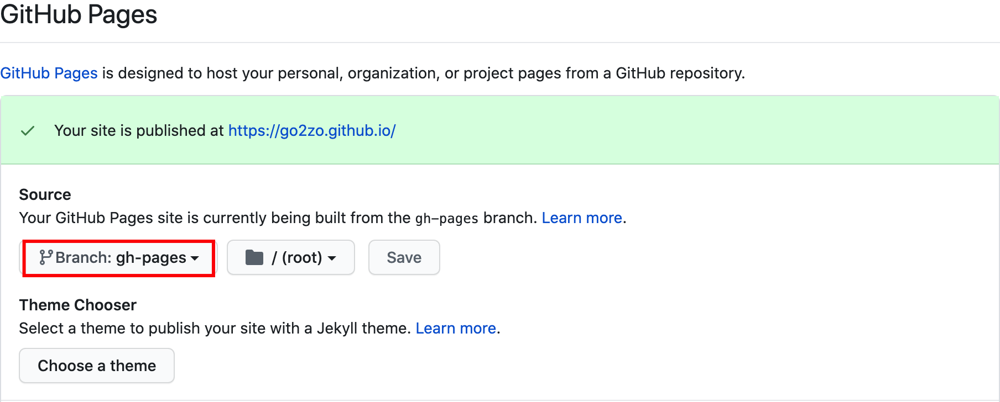

## 첫 포스트 작성

마크다운 파일들이 각각의 웹페이지로 변경될 때 경로는 glob 패턴으로 작성되며 이에 대한 설정은 `gridsome.config.js`에 있다.

기본적으로 `title`을 사용하도록 설정되어 있는데  [kebab case](https://en.wiktionary.org/wiki/kebab_case)로 변환하여 사용한다. `title: Say hello to Gridsome 🎉`이라면 생성되는 경로는 `/say-hello-to-gridsome`이 된다.

```js
// gridsome.config.js
{
  templates: {
    Post: '/:title',
    Tag: '/tag/:id',
  },
}
```

여기서 한가지 문제가 있는데 한글이나 특수문자가 지원되지 않는 것이다.

```yaml
title: Gridsome으로 Blog 만들기 (1) - 환경 설정
```

위와 같이 작성하는 경우 생성된 경로는 `gridsome-blog-1`로 의도하지 않은 결과이다. 이를 해결하기 위해서 front-matter을 `path` 항목을 새로 만들고 gridsome 설정을 변경하였다.

```yaml
title: Gridsome으로 Blog 만들기 (1) - 환경 설정
path: make-blog-with-gridsome-1
```

```js
// gridsome.config.js
{
  templates: {
    Post: '/blog/:path',
    Tag: '/tag/:id',
  },
}
```

번거롭긴 하지만 한글 제목을 위해서 아직까진 어쩔 수 없는 선택같다.

## GitHub Pages 설정

GitHub Pages는 개인 혹은 프로젝트 별로 GitHub에서 제공하는 웹사이트이다. (이미 많이 알고 있을 것이므로 자세한 설명은 생략)

이미 과거에 저장소는 생성되어 있었고 Jekyll 프로젝트가 배포되어 있는 상태였다. 최신 흐름에 맞춰 `master` 브랜치를 과감히 날려버리고 새로운 소스를 `main` 브랜치로 푸시하였다. `{account}.github.io` 저장소는 기본적으로 master(혹은 main) 브랜치를 이용해 호스팅을 한다. 하지만 원본 소스도 저장하기 위해 호스트 브랜치를 `gh-pages`로 변경했다. `Settings > Options > GitHub Pages`에서 변경이 가능하다.



## GitHub Pages에 배포

기본적인 배포 과정은 다음과 같다.

> 1. `gridsome build`로 static site 생성
> 2. 저장소에 push (`gh-pages` 패키지 이용)

이미 스타터를 통해 모두 추가되어 있긴 하지만 잠시 설명을 하자면 퍼블리싱을 위한 `gh-pages` 패키지를 설치한다.

```bash
yarn add -D gh-pages
```

아래 두 스크립트가 빌드와 배포를 실행하게 된다. 배포전에는 빌드가 되어야 하므로 배포 스크립트에 빌드를 추가하였다. 스크립트가 없다면 `package.json`에 추가하면 된다.

```json
// package.json
{
  "scripts": {
    "build": "gridsome build",
    "deploy": "gridsome build && gh-pages -d dist",
  },
}
```

배포를 실행해보자.

```bash
yarn deploy
```

정상적으로 배포가 완료되면 웹사이트에 접속하여 확인할 수 있다. (실시간으로 배포되지는 않지만 그리 오래 걸리지도 않는다.)


