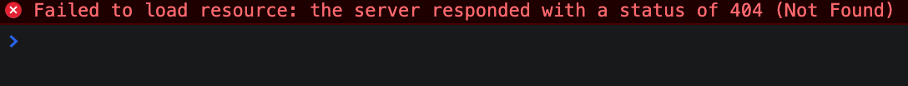

## 마크다운과 이미지 삽입

나는 typora와 lightshot을 이용해 마크다운 내 캡쳐 이미지 삽입의 편리성을 도모한다. typora 설정으로 ./images/` 디렉터리에 자동 저장하게 했으며 이는 그렇게 편할 수가 없다.

붙여넣기 하는 순간 파일은 저장되고 본문에는 아래와 같이 삽입된다.

```markdown

```

## 404 에러

그런데 `gridsome develop`으로 실제 배포를 해보면 이미지가 로드되지 않는 문제가 있었다.


> "이미지 위치가 잘못되었나? 이미지 배포와 관련한 플러그인이 따로 있나?"

이런저런 고민이 들었지만 gridsome.org 저장소의 블로그에는 이미지가 post별로 저장되어 있었기 때문에 전자는 아닐거라 생각했다. 그래서 따로 플러그인이 있는지 [gridsome 플러그인](https://gridsome.org/plugins/)과 [remark 플러그인](https://github.com/remarkjs/remark/blob/main/doc/plugins.md#list-of-plugins)을 뒤져봤지만 별다른 성과는 없었다.

## 허무한 결론

그러다 문득 `./` 혹은 `../` 없이 상대경로를 표시할 때 프로젝트 root에서 찾는 경우가 생각나 이미지 경로에 적용하니 이미지가 정상적으로 로드되었다.

다시 한번 보면, 아래와 같이 작성하면 이미지가 제대로 로드된다.

```markdown

```


그리고 이렇게 작성하면 대체 텍스트가 표시 될 것이다.

```markdown

```


