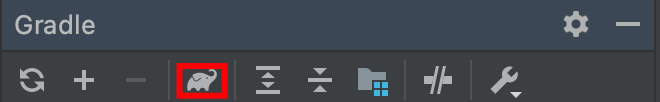

## 'Java SE 11' using tool chain: 'JDK 8 (1.8)'

IntelliJ에서 gradle task를 실행할 때 보통 tool windows의 `Execute gradle task` 버튼(코끼리모양)을 이용하곤 한다.



그런데 터미널에서 `./gradlew build` 명령어로 실행하려 하니 아래와 같이 에러가 발생한다.


```bash
Task :compileJava FAILED

FAILURE: Build failed with an exception.

* What went wrong:
Execution failed for task ':compileJava'.
> Could not target platform: 'Java SE 11' using tool chain: 'JDK 8 (1.8)'.

* Try:
Run with --stacktrace option to get the stack trace. Run with --info or --debug option to get more log output. Run with --scan to get full insights.

* Get more help at https://help.gradle.org

BUILD FAILED in 3s
1 actionable task: 1 executed
```

## 보편적인 확인 사항

1. File > Project Structure... > Project

   : Project SDK에 Java 11인지 확인한다.

2. File > Project Structure... > Modules

   : Language level에 Java 11인지 확인한다. 보통 프로젝트를 따르도록(`Project default`) 설정한다.

3. Preferences > Build, Execution, Deployment > Build Tools > Gradle

   : Gradle JVM에 Java 11인지 확인한다. 프로젝트를 따르도록(Project SDK) 설정한다.

4. build.gradle 파일의 `targetCompatibility = '11'` 인지 확인한다.

## 나의 경우

하지만 여전히 동일한 에러를 발생하고 있었고 아차싶어 `gradlew` 파일을 열어보니 당연하게도 스크립트는 IntelliJ 설정과 무관하게 `JAVA_HOME`을 참조하고 있었다.

Java 버전 관리는 [sdkman](https://sdkman.io/)을 이용하고 있고 멀티 버전이 설치되어 있는 와중에 기본설정이 8로 되어 있었다.

```bash
sdk current java

Using java version 8.0.265.hs-adpt
```

Global 설정을 java 11로 변경하고 에러가 해결 되었다.

```bash
sdk use java 11.0.11.hs-adpt

Using java version 11.0.11.hs-adpt in this shell.
```


