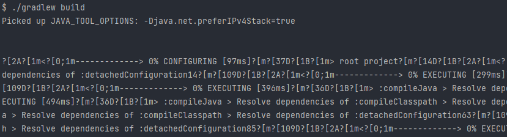

## IntelliJ IDEA Terminal

인텔리제이에서 터미널을 변경하는 방법은 `Settings > Tools > Terminal`에 들어가 Shell path를 Git bash 실행파일로 변경해주면 된다.

윈도우의 경우 초기 설정은 `cmd.exe` 혹은 `powershell.exe`로 되어있다.

보통 윈도우에 Git을 설치한 경우 시작메뉴에 등록된 Git bash 바로가기의 실행파일은 `%GIT_HOME%\git-bash.exe`로 되어있다. (GIT_HOME은 보통 `C:\Program Files\Git`이다.) 이 실행파일을 지정하게 되면 인텔리제이에서 터미널을 띄울 때 새로운 MINGW64 창이 열린다.

터미널 뷰에 git bash가 열리게 하려면 `%GIT_HOME%\bin\bash.exe`(혹은 sh.exe)를 지정하면 된다.

### 제어문자가 왜 출력돼?

그런데 progress bar같이 터미널에서 내용이 갱신되어 출력되는 스크립트가 있다면 아래와 같이 정상적인 출력이 되지 않고 제어문자가 출력되는 문제가 발생한다.



이 때는 Shell path를 아래와 같이 변경해 주면 해결된다. (당췌 실행파일들이 왜 이렇게 나뉘어 있는지 모르겠다.)

```bash
"%GIT_HOME%\usr\bin\bash.exe" --login -i
```

이후 터미널을 재실행한다.

