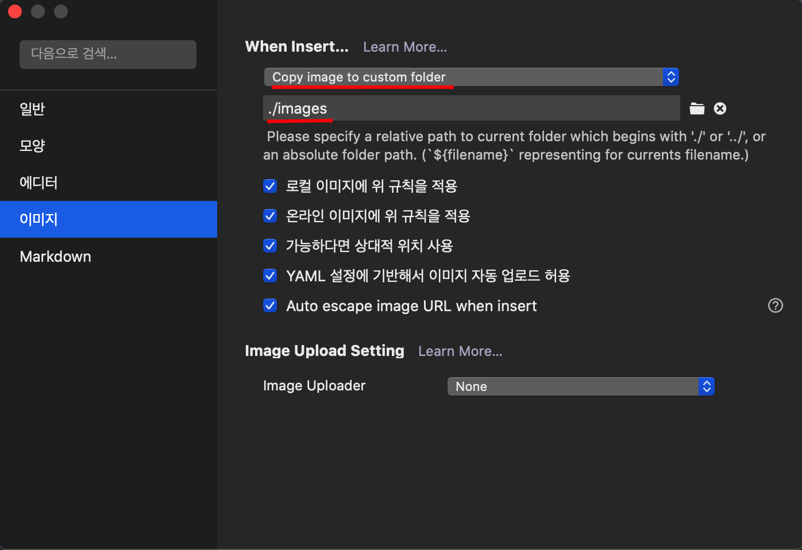

# Prerequisite

- NodeJS
- Npm or Yarn

***

# [Gridsome](https://gridsome.org/) 설치

```bash
# Npm
$ npm install -g gridsome

# Yarn
$ yarn global add gridsome
```

***

# 프로젝트 생성

기본 프로젝트로 생성하면 설정들을 일일이 해나가는 번거로움이 있다.

Gridsome 공식페이지에 제공하는 [스타터](https://gridsome.org/starters/)를 이용하면 개발을 쉽게 시작할 수 있다.

본인은 의도한 형태와 가장 유사한 [Bulma Starter](https://gridsome.org/starters/bulma-starter/)로 시작하려 한다.

```bash
$ gridsome create go2zo.github.io https://github.com/calebanthony/gridsome-bulma.git
```


***

# 디렉토리 구조

Gridsome의 기본 디렉토리 구조는 다음과 같다.


```
.
├── package.json
├── gridsome.config.js
├── gridsome.server.js
├── static/
└── src/
    ├── main.js
    ├── index.html
    ├── App.vue
    ├── layouts/
    │   └── Default.vue
    ├── pages/
    │   ├── Index.vue
    │   └── Blog.vue
    └── templates/
        └── BlogPost.vue
```

우선 크게 건드릴 필요 없는 것들은 제외하고 설명하면 다음과 같다. 자세한 설명은 공식문서에 잘 나와있다.

- **gridsome.config.js**: 플러그인 설정 등 Gridsome 프로젝트에 대한 설정을 다룬다.
- **src/layout**: 페이지나 템플릿에서 사용하는 레이아웃 컴포넌트들을 구현한다.
- **src/pages**: 이 디렉토리의 컴포넌트들은 각각 웹사이트의 url 된다. 가령 `src/pages/Index.vue`는 홈페이지가 되고 `src/pages/AboutUs.vue`는 `hostname/about-us`가 된다.
- **src/templates**: 템플릿은 collection 노드들에 대한 단일 페이지를 생성한다. 가령 포스트(md파일)가 웹페이지로 변환될 때 해당하는 템플릿을 이용하게 된다.

# 블로그 확인

로컬 환경에서 웹서비스를 띄워 생성된 블로그를 확인한다.

`gridsome develop`이나 `yarn develop`으로 실행한다.

```bash
$ gridsome develop

 DONE  Compiled successfully in 978ms
 
  Site running at:
  - Local:                 http://localhost:8080/
  - Network:               http://192.168.219.106:8080/
   
  Explore GraphQL data at: http://localhost:8080/___explore
```

접속하여 페이지가 정상적으로 뜨면 성공이다.

# Eslint 설정

Gridsome을 위한 Eslint [플러그인](https://eslint.gridsome.org/user-guide/)이 있다.

> 처음 연습 시 [Gridsome Blog Starter](https://gridsome.org/starters/gridsome-blog-starter/)를 사용했었는데 해당 스타터는 eslint 설정이 되어있지 않아 직접 설정했다. [Bulma Starter](https://gridsome.org/starters/bulma-starter/)는 eslint 설정이 아래 나와있는 것보다 더 잘 되어있어 추가적으로 수정한 부분은 `.eslintignore` 뿐이다.
>
> 만약 스타터를 이용하지 않거나 선택한 스타터에 eslint 설정이 되어있지 않다면 참조하면 될 듯 하다.

## Dependencies 설치

```bash
# Npm
$ npm install eslint eslint-plugin-gridsome vue-eslint-parser -D

# Yarn
$ yarn add eslint eslint-plugin-gridsome vue-eslint-parser -D
```

> `eslint-plugin-gridsome`은 `vue-eslint-parser@^6.0.4` 버전 이상을 사용하고 있다.
>
> 다른 eslint 플러그인을 사용하는 경우 `vue-eslint-parser` 버전을 주의해야 한다.

## .eslintrc.js 설정

[gridsome/recommended](https://github.com/gridsome/eslint-plugin-gridsome/blob/45395586e812167f1c1eb7e9c02d4e4a86b2b9ff/lib/configs/recommended.js) 문서를 참고하여 작성하였다.

```js
// .eslintrc.js
module.exports = {
  parser: "vue-eslint-parser",
  parserOptions: {
    ecmaVersion: 2018,
    sourceType: "module",
    ecmaFeatures: {
      jsx: true
    }
  },
  env: {
    browser: true,
    es6: true
  },
  extends: ["plugin:gridsome/recommended"],
};
```

## package.json 설정

Eslint 실행을 위한 스크립트를 추가한다.

```json
// package.json
{
  "scripts": {
    "lint": "eslint --ext .js,.vue src/",
  },
}
```

## .eslintignore 설정

기본 생성되는 `main.js` 파일은 eslint에서 에러를 유발한다. Rule을 변경하기에는 애매하여 제외하도록 설정했다. 명령어에서 추가할 수 있지만 향후 예외 파일이 추가될 가능성이 있기 때문에 `.eslintignore`를 이용했다.

```js
// .eslintignore
src/main.js
```


# Dev Tools 설정

Gridsome 프로젝트를 진행하기 위해 아래와 같이 두개의 에디터를 사용한다.

- [Visual Studio Code](https://code.visualstudio.com/): 프로젝트 전체적인 관리
- [Typora](https://typora.io/): Markdown 편집

> VS Code로도 마크다운 편집이 가능하지만 개인적으로 마크다운 에디터는 Typora를 선호한다. 두개의 에디터를 사용하면 사소한 불편사항이 생기긴 한다. 가령 VSCode에서 디렉토리를 변경하게 되면 Typora는 반영이 되지 않아 재부팅을 해줘야 한다. 혹은 실수로 양쪽에서 동일한 md 파일을 동시에 수정하는 불상사가 생길 수 있지만 크게 우려할 정도는 아닌것 같다.

## VSCode 설정

> 설치는 VSCode의 Extensions 탭에서 검색 후 설치하면 된다.

### Vetur

[Vetur](https://marketplace.visualstudio.com/items?itemName=octref.vetur)는 VSCode를 위한 Vue 도구이다.

Vue 기반인 Gridsome과 완벽히 동작한다.

### GraphQL

[GraphQL data layer](https://gridsome.org/docs/data-layer/)는 개발 모드에서 사용할 수 있는 도구이다.

Vue 컴포넌트 내부에서 `<page-query>` 또는 `<static-query>` 블록으로 쿼리를 작성할 수 있다.

아래 설정을 통해 .vue파일 내부에 작성된 GraphQL 구문을 분석할 수 있다.

1. [GraphQL for VSCode](https://marketplace.visualstudio.com/items?itemName=kumar-harsh.graphql-for-vscode) 설치

2. Preferences > Settings을 열어 `vetur grammar` 검색


3. `settings.json`을 열어 아래와 같이 추가

```json
// settings.json
{
   "vetur.grammar.customBlocks": {
      "docs": "md",
      "i18n": "json",
      "page-query": "graphql",
      "static-query": "graphql"
   }
}
```

4. VSCode Command 실행: `Vetur: Generate Grammar`

> 단축키 `Shift + Ctrl + P` (MAC은 `Shift + Cmd + P`)으로 실행

## Typora 설정

캡쳐 도구로 [Lightshot](https://app.prntscr.com/en/index.html)을 사용한다. 캡쳐한 이미지를 클립보드에 복사하여 Typora에 붙여넣으면 자동으로 이미지를 저장한다. (이 외에 업로드 기능도 제공한다.)

기본적으로 Typora 설치 폴더 하위에 저장하는데 `content/posts/images` 하위에 저장하도록 설정하였다.



# 다음은..

이번 포스트는 기본적으로 개발환경을 구성하는 부분까지만 다뤘다.

다음에는 새로운 포스트를 작성하고 깃허브 페이지에 배포하는 것을 다루도록 한다.
