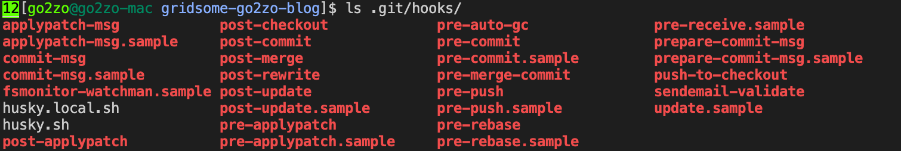

# [Husky](https://typicode.github.io/husky/#/)란?

Husky는 node 환경에서 git hook 제어를 용이하게 해 주는 툴이다. 기본적으로 git hook은 로컬저장소의 `.git/hooks` 디렉토리에 위치해 있다. 그리고 이 디렉토리는 git 버전관리의 대상이 아니다. husky는 hook을 공유 가능하도록 해준다.

husky를 설치하면 모든 git hook은 husky를 실행하도록 설정된다. 실제로 husky를 설치하고 `.git/hook` 디렉토리를 확인하면 모든 hook 파일들이 활성화(.sample이 붙어있지 않은 파일들) 되어 있는 것을 볼 수 있다. husky에 의해 생성된 파일들은 수동으로 변경하지 않아야 한다(~~고 알고 있다~~). 어차피 변경을 해도 변경사항은 공유되지 않을 것이다.



# Lint-staged & Husky 설치

[mrm](https://mrm.js.org/)은 오픈소스 프로젝트의 환경 설정을 동기화 하기 위한 도구이다. lint-staged도 지원하고 있으며 공식문서에도 아래와 같이 설치하도록 안내하고 있다.

```bash
$ npx mrm lint-staged
```

어떻게 설치되는지 보려고 package.json에서 lint-staged관련 설정들을 모두 지우고 실행해 봤다. 아래와 같이 `pre-commit` 시 `lint-staged`가 실행되도록 설정된 것을 볼 수 있다.

```json
// package.json
{
  "husky": {
    "hooks": {
      "pre-commit": "lint-staged"
    }
  },
  "lint-staged": {
    "*.{js,vue}": "eslint --cache --fix"
  }
}
```

# Commit message에 Issue Number 자동 삽입

husky를 이용해 npm script만 사용 가능한 것은 아니다.

쉘 스크립트도 실행 가능하고 복잡한 스크립트는 파일로 따로 작성하여 호출할 수 있다.

```json
// package.json
{
  "husky": {
    "hooks": {
      "pre-commit": "lint-staged && your-custom-script.sh"
    }
  }
}
```

이를 이용해 commit message에 issue 번호를 삽입하는 기능을 추가해 보려 한다.

해당 기능은 commit message를 준비하는 과정으로 `prepare-commit-msg` 훅에 속한다.

```json
// package.json
{
  "husky": {
    "hooks": {
      "pre-commit": "lint-staged",
      "prepare-commit-msg": "./scripts/add_issue_number_into_commit.sh $HUSKY_GIT_PARAMS"
    }
  }
}
```

실제 동작하는 스크립트는 아래와 같이 작성되었다. ([husky님의 블로그 글](https://www.huskyhoochu.com/npm-husky-the-git-hook-manager/)을 대부분 참조했다.)

```sh
#!/usr/bin/env bash

COMMIT_MSG_FILE=$1

branch_name=`git rev-parse --abbrev-ref HEAD`
cut_number=`echo ${branch_name} | cut -d '-' -f1`
first_line=`head -n1 ${COMMIT_MSG_FILE}`

# if commit_msg_file's first line is empty,
# add branch name in commit_msg
if [ -z "$first_line" ]; then
    sed -i ".bak" "1s/^/[#$cut_number] /" $1
fi
```

스크립트 실행 시 `HUSKY_GIT_PARAMS`로 git 파라미터를 bypass로 전달한다.

| Index | Name            | Description                                                  |
| ----- | --------------- | ------------------------------------------------------------ |
| $1    | COMMIT_MSG_FILE | 이 변수가 가리키는 `.git/COMMIT_EDITMSG` 파일은 커밋 시 출력되는 메시지를 담고 있다. |
| $2    | COMMIT_SOURCE   | merge, message, template, commit 등 커밋의 종류를 나타낸다.  |
| $3    | SHA             | 최근 커밋 수정(commit -amend)의 경우에는 커밋 hash 값을 추가로 받는다. |

# References

- <https://www.huskyhoochu.com/npm-husky-the-git-hook-manager/>

